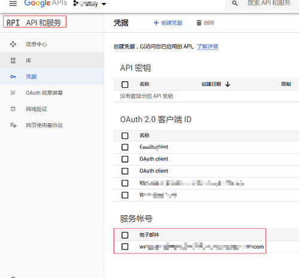
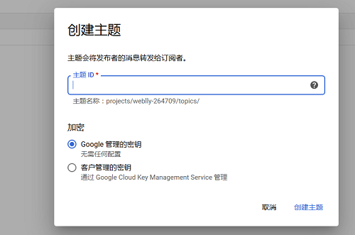
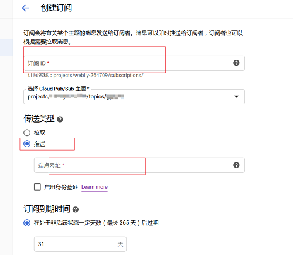
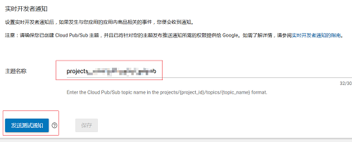
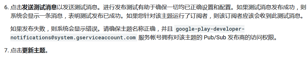

### 添加实时开发者通知
### Google Payment API, In-App-Billing, Subscription, Webhook

#### 添加实时开发者通知
###### 创建服务账号  

###### `GCP控制台>Pub/Sub` 创建主题和订阅   
   
###### 创建订阅，我们选择推送方式  
> 确保`google-play-developer-notifications@system.gserviceaccount.com` 服务帐号拥有对该主题的Pub/Sub发布商的访问权限  
> 复制主题名称并配置到 `应用管理>开发工具>服务和API`  
  
> 
###### 发送测试通知  
  

#### 参考资料
* [添加实时开发者通知](https://developer.android.com/google/play/billing/realtime_developer_notifications.html)  
* [使用推送订阅](https://cloud.google.com/pubsub/docs/push)  
* [使用拉取接收消息](https://cloud.google.com/pubsub/docs/pull)  
* [Purchases.subscriptions](https://developers.google.com/android-publisher/api-ref/purchases/subscriptions)  
