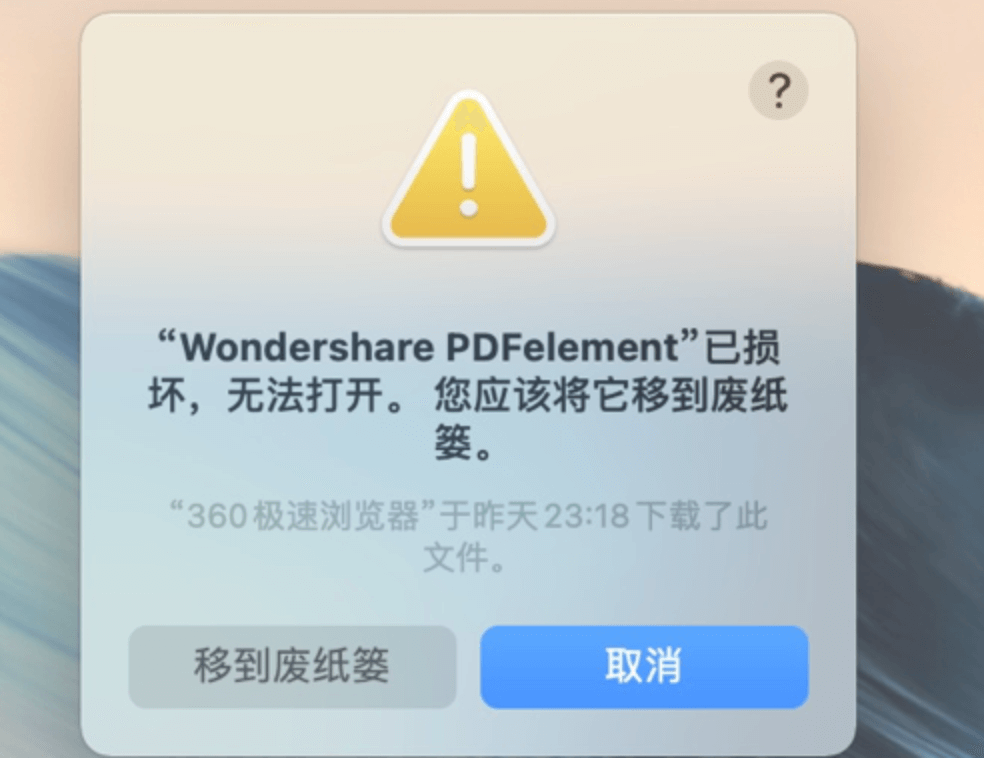
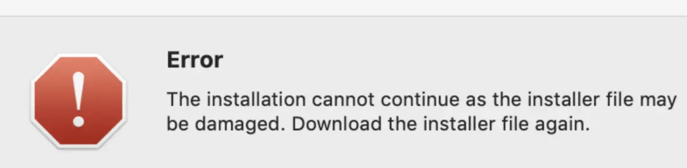
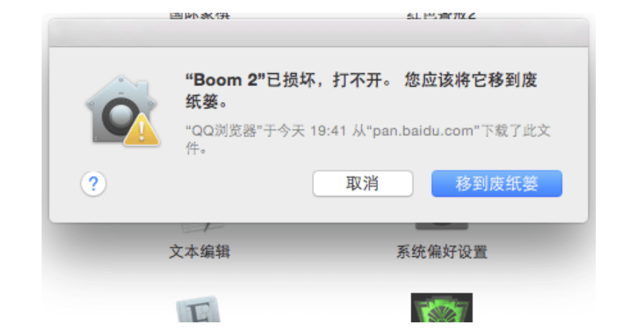
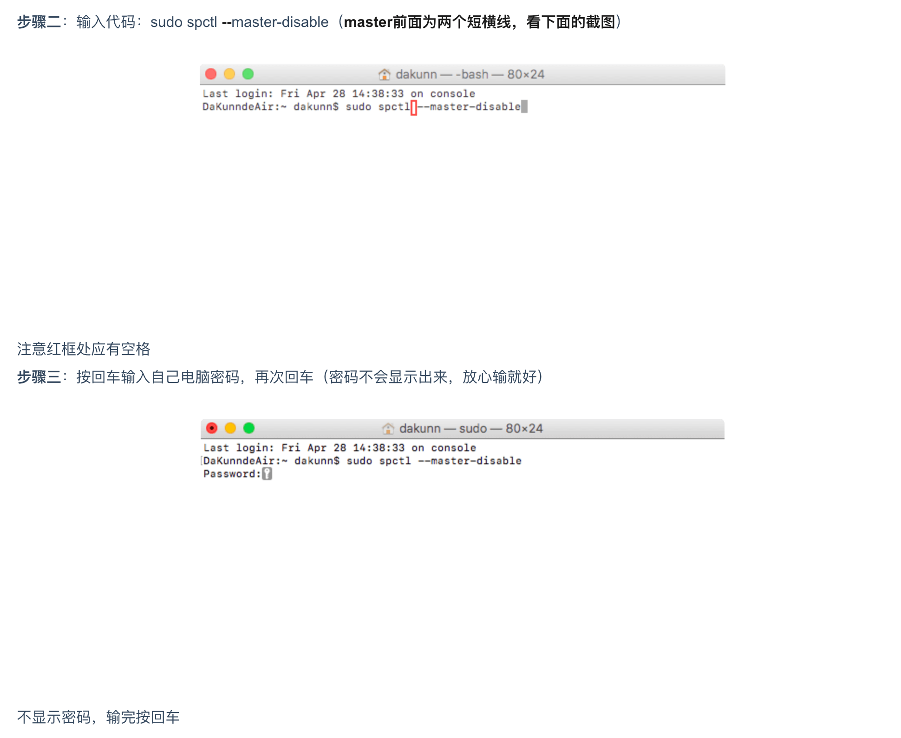
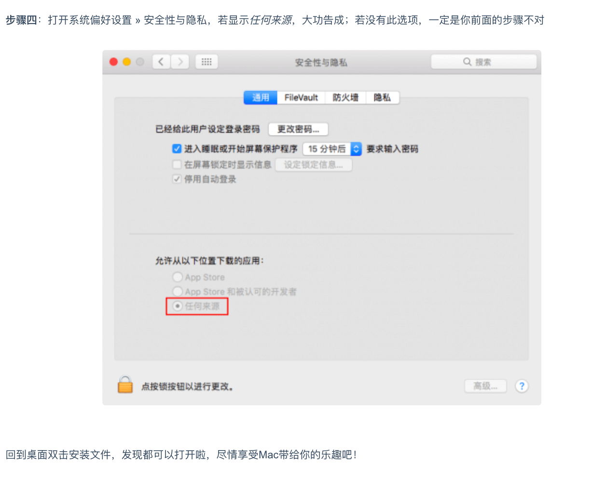

## Mac安装软件时各种异常情况的解决方法

#### 提示程序含有恶意代码或者已经打开所有来源还是提示扔到垃圾桶
> 基本上在11以后的系统上必备命令行，具体报错图如下  

 
> 解决方法：在终端输入 xattr -r -d com.apple.quarantine 加上程序的App绝对路径，App建议直接拖放到终端，会自动填写路径，比如WeChat，最终应该是这样的一个终端命令
```
xattr -r -d com.apple.quarantine /Applications/QQ.app（/Applications/WeChat.app 前面有一个空格）
```
#### Mac安装软件时提示“the installation cannot continue as”
> 这种错误常见于10.15以后的系统中安装Adobe系列软件时候出现，报错如下图

 
> 解决方法如下： 
```
双击打开dmg安装包
在 install.app 上右键，选择 显示包内容
依次进入 Contents 下的 MacOS  目录
双击 MacOS  目录中的 install 即可开始正常的安装流程了
```
#### 安装 提示已损坏，打不开，您应该将它移至废纸篓
> 从本站下载的Sketch、Principle等设计软件，以及输入法等常用软件，安装时总是提示“已损坏，移至废纸篓”这类信息，根本无法打开。如下图：

 
> 其实，这是新系统（macOS Sierra 10.12.X）惹的祸。新系统加强了安全机制，默认不允许用户自行下载安装应用程序，只能从Mac App Store里安装应用。 
> 解决方法
```
步骤一：打开终端
步骤二：输入代码：sudo spctl --master-disable（master前面为两个短横线，看下面的截图）
```
 
 
#### 安装出现闪退等其他情况
> 2019年7月10号开始，很多TNT破解软件大面积报错，原因不多说，讲一下具体的解决方案
```
步骤一：
安装xcode，这个在商店里面有，不想安装的，按步骤二来。

步骤二：
安装Command Line Tool 工具

打开终端输入以下命令
xcode-select --install （install前面为两个短横线）

步骤三：
终端继续输入以下命令
codesign --force --deep --sign - （force、deep、sign前面为两个短横线）

然后拖入需要签名的软件，最后类似于这样
codesign --force --deep --sign - /Applications/name.app （/Applications前面有一个空格）


回车搞定
```